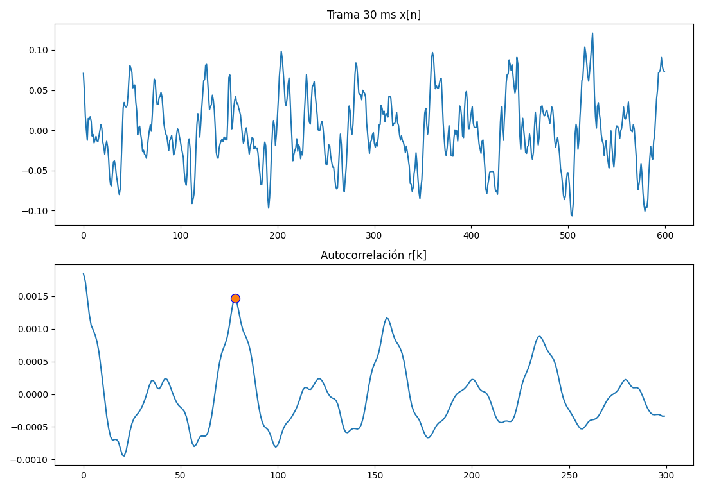
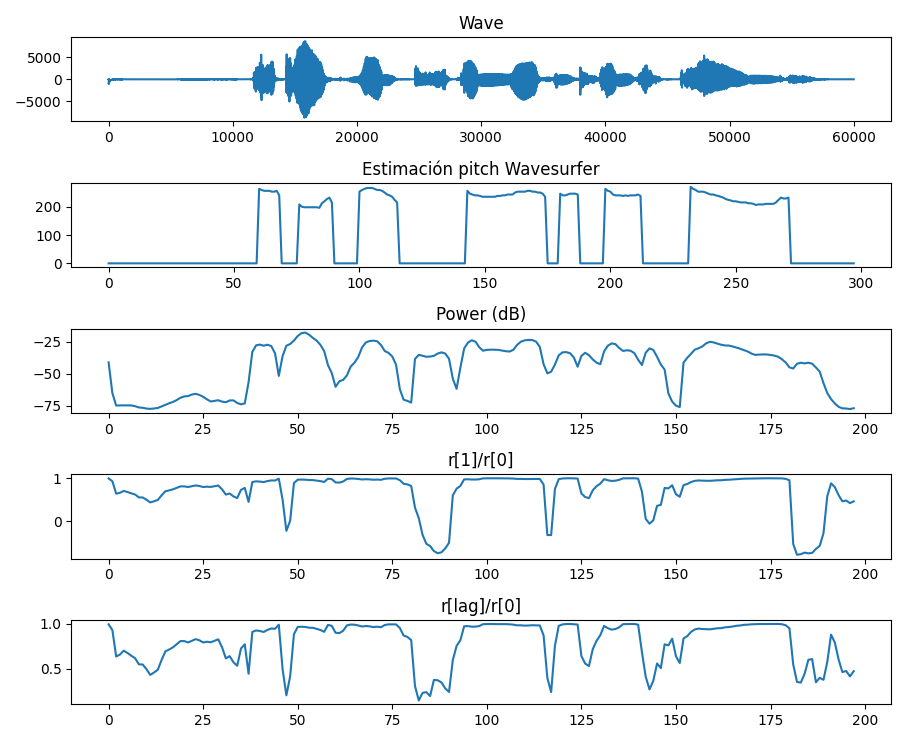
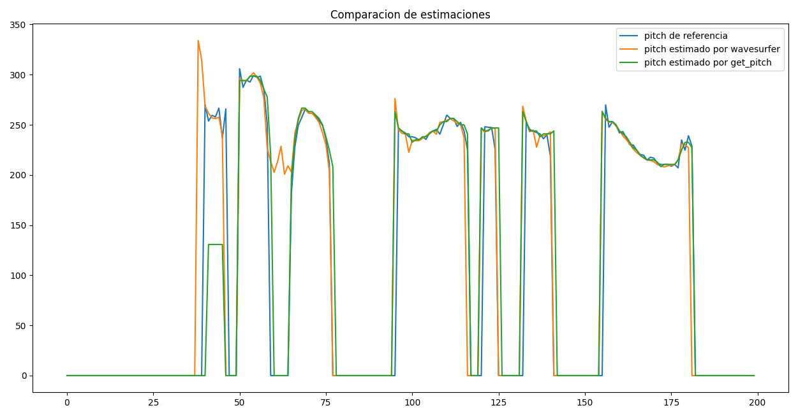

PAV - P3: estimación de pitch
=============================

Esta práctica se distribuye a través del repositorio GitHub [Práctica 3](https://github.com/albino-pav/P3).
Siga las instrucciones de la [Práctica 2](https://github.com/albino-pav/P2) para realizar un `fork` de la
misma y distribuir copias locales (*clones*) del mismo a los distintos integrantes del grupo de prácticas.

Recuerde realizar el *pull request* al repositorio original una vez completada la práctica.

Ejercicios básicos
------------------

- Complete el código de los ficheros necesarios para realizar la estimación de pitch usando el programa
  `get_pitch`.

   * Complete el cálculo de la autocorrelación e inserte a continuación el código correspondiente.
     ```c++
      void PitchAnalyzer::autocorrelation(const vector<float> &x, vector<float> &r) const {
        for (unsigned int l = 0; l < r.size(); ++l) {
        r[l] = 0;
        for(unsigned int n=0; n<x.size(); n++){ // i n=0?
           r[l] += x[n]*x[n+l];
        }
       r[l] /= x.size();
      }
      ```
      > Aquesta funció calcula l'autocorrelació. Li passem el vector x de senyal i el vector r que és el que plenem amb l'autocorrelació. 


   * Inserte una gŕafica donde, en un *subplot*, se vea con claridad la señal temporal de un segmento de
     unos 30 ms de un fonema sonoro y su periodo de pitch; y, en otro *subplot*, se vea con claridad la
	 autocorrelación de la señal y la posición del primer máximo secundario.
  
      

      > Vemos que la autocorrelación presenta su segundo maximo con un lag de 78, correspondiendo con un pitch de 20 kHz/78 = 256'41 Hz. 

	 NOTA: es más que probable que tenga que usar Python, Octave/MATLAB u otro programa semejante para
	 hacerlo. Se valorará la utilización de la biblioteca matplotlib de Python.

   * Determine el mejor candidato para el periodo de pitch localizando el primer máximo secundario de la
     autocorrelación. Inserte a continuación el código correspondiente.
      ```c++
        vector<float> r(npitch_max);
        autocorrelation(x, r);
        int iRMax = 0;
        float Rmax = 0;

        for(int i=npitch_min; i<npitch_max; i++){
          if(r[i]>Rmax){ 
            Rmax = r[i];
            iRMax = i;
          }
        }
        unsigned int lag = iRMax;
        ```

    
   * Implemente la regla de decisión sonoro o sordo e inserte el código correspondiente.
      ```c++
      bool PitchAnalyzer::unvoiced(float pot, float r1norm, float rmaxnorm) const {
        int c=0;
        if(rmaxnorm>umaxnorm) c++;
        if(r1norm>llindarUnvoiced) c++;
        if(pot>llindarPot) c++;
        if(c>2){
          return false;   
        }
        return true;
      }
      ```
      > Se ha decidido implementar con un contador de condiciones cumplidas para poder jugar con él. En la pràctica, comprobamos que el mejor estimador de voz se da al exigir todas las condiciones.

- Una vez completados los puntos anteriores, dispondrá de una primera versión del estimador de pitch. El 
  resto del trabajo consiste, básicamente, en obtener las mejores prestaciones posibles con él.

  * Utilice el programa `wavesurfer` para analizar las condiciones apropiadas para determinar si un
    segmento es sonoro o sordo. 
	
	  - Inserte una gráfica con la estimación de pitch incorporada a `wavesurfer` y, junto a ella, los 
	    principales candidatos para determinar la sonoridad de la voz: el nivel de potencia de la señal
		(r[0]), la autocorrelación normalizada de uno (r1norm = r[1] / r[0]) y el valor de la
		autocorrelación en su máximo secundario (rmaxnorm = r[lag] / r[0]).

		Puede considerar, también, la conveniencia de usar la tasa de cruces por cero.

	    Recuerde configurar los paneles de datos para que el desplazamiento de ventana sea el adecuado, que
		en esta práctica es de 15 ms.

        

      - Use el estimador de pitch implementado en el programa `wavesurfer` en una señal de prueba y compare
	    su resultado con el obtenido por la mejor versión de su propio sistema.  Inserte una gráfica
		ilustrativa del resultado de ambos estimadores.
     
		Aunque puede usar el propio Wavesurfer para obtener la representación, se valorará
	 	el uso de alternativas de mayor calidad (particularmente Python).

        

        > En la anterior grafica podemos ver nuestro estimador contra el pitch de referencia y contra el estimador de wavesurfer. Podemos ver que el nuestro (exceptuando el principio), se ciñe mas a la frecuencia real.
  
  * Optimice los parámetros de su sistema de estimación de pitch e inserte una tabla con las tasas de error
    y el *score* TOTAL proporcionados por `pitch_evaluate` en la evaluación de la base de datos 
	`pitch_db/train`..

    ```
    ### Summary
    Num. frames:    11200 = 7045 unvoiced + 4155 voiced
    Unvoiced frames as voiced:      215/7045 (3.05 %)
    Voiced frames as unvoiced:      364/4155 (8.76 %)
    Gross voiced errors (+20.00 %): 50/3791 (1.32 %)
    MSE of fine errors:     2.66 %
    ===>    TOTAL:  91.65 %
    --------------------------
    ```

Ejercicios de ampliación
------------------------

- Usando la librería `docopt_cpp`, modifique el fichero `get_pitch.cpp` para incorporar los parámetros del
  estimador a los argumentos de la línea de comandos.
  
  Esta técnica le resultará especialmente útil para optimizar los parámetros del estimador. Recuerde que
  una parte importante de la evaluación recaerá en el resultado obtenido en la estimación de pitch en la
  base de datos.

  * Inserte un *pantallazo* en el que se vea el mensaje de ayuda del programa y un ejemplo de utilización
    con los argumentos añadidos.
    ```
    $ get_pitch -h

    get_pitch - Pitch Estimator

    Usage:
        get_pitch [options] <input-wav> <output-txt>
        get_pitch (-h | --help)
        get_pitch --version

    Options:
        -h, --help  Show this screen
        --version   Show the version of the project
        -w <window-type>, --window=<window-type>  Define windowing to use [default: RECT]
        -1 FLOAT, --param1=FLOAT  Define parameter 1 (r[max]/r[0]) for voice detection [default: 0.406]
        -2 FLOAT, --param2=FLOAT  Define parameter 2 (r[1]/r[0]) [default: 0.5]
        -3 FLOAT, --param3=FLOAT  Define parameter 3 (pot) [default: -46]
        -c FLOAT, --centerclipth=FLOAT  Define center clipping threshhold [default: 0.0001]

    Arguments:
        input-wav   Wave file with the audio signal
        output-txt  Output file: ASCII file with the result of the estimation:
                        - One line per frame with the estimated f0
                        - If considered unvoiced, f0 must be set to f0 = 0
    ```

- Implemente las técnicas que considere oportunas para optimizar las prestaciones del sistema de estimación
  de pitch.

  Entre las posibles mejoras, puede escoger una o más de las siguientes:

  * Técnicas de preprocesado: filtrado paso bajo, diezmado, *center clipping*, etc.
    ```c++
    for(unsigned int k=0; k<x.size(); k++){
      if(abs(x[k])<ccth){
        x[k]=0;
      }
    }
    ```
    > Con este filtro reducimos el ruido en los momentos de silencio, evitando asi posibles falsos positivos a la hora de determinar la sonoridad de una trama. De momento, usaremos un treshold de 0.01.

  * Técnicas de postprocesado: filtro de mediana, *dynamic time warping*, etc.
    ```c++
    vector<float> element;     
    vector<float> f0_filtrado;          
    f0_filtrado.push_back(f0[0]);       
    for (unsigned int l=1; l<f0.size()-1; l++){   
        for(int r=-1; r<2; r++){    
          element.push_back(f0[l+r]);   
        }
        sort(element.begin(),element.end());   
        f0_filtrado.push_back(element[1]);    
        element.clear();    
      }
    f0_filtrado.push_back(f0[f0.size()-1]); 
    f0 = f0_filtrado;
    ```
    > Este filtro de mediana pretende evitar el posible efecto de doblar o reducir a la mitad accidentalmente la frecuencia fundamental encontrada.

  * Métodos alternativos a la autocorrelación: procesado cepstral, *average magnitude difference function*
    (AMDF), etc.

  * Optimización **demostrable** de los parámetros que gobiernan el estimador, en concreto, de los que
    gobiernan la decisión sonoro/sordo.
    ```bash
    #!/bin/bash
    DIR_P3=$HOME/PAV/P3
    DB=$DIR_P3/pitch_db/train
    CMD="get_pitch "
    BESTSCORE=0
    A=0
    param1=0.406 param2=0.5 param3=-46 ccparam=0
    #apt install dc

    for param1 in $(seq .40 .003 .42); do 
    for param2 in $(seq .4 .02 .5); do
    for param3 in $(seq -47 1 -43); do
    for ccparam in $(seq 0 0.0001 0.001); do
        echo -e -n "\rPitchAnalyzer with param1=$param1, param2=$param2, param3=$param3, ccth=$ccparam"
        for filewav in pitch_db/train/*.wav; do
            ff0=${filewav/.wav/.f0}
            #echo "$CMD --param1 $param1 --param2 $param2 --param3 $param3 $filewav $ff0"
            $CMD -1 $param1 -2 $param2 -3 $param3 -c $ccparam $filewav $ff0 || (echo -e "\nError in $CMD $filewav $ff0" && exit 1) 
        done
        A=$(pitch_evaluate_noverb pitch_db/train/*.f0ref)
        if ! echo "$A $BESTSCORE -p" | dc | grep > /dev/null ^-; then
            BESTSCORE=$A
            clear
            echo -e "New Best score $BESTSCORE with parameters  param1=$param1, param2=$param2, param3=$param3, ccth=$ccparam"
        fi
        done done done done
    exit 0
    ```
    > Con este script podemos definir entre que umbrales y con que paso queremos probar nuestro sistema. Hemos tenido que hacer otro programa evaluador que solo nos retorne el porcentaje total.

  * Cualquier otra técnica que se le pueda ocurrir o encuentre en la literatura.

  Encontrará más información acerca de estas técnicas en las [Transparencias del Curso](https://atenea.upc.edu/pluginfile.php/2908770/mod_resource/content/3/2b_PS%20Techniques.pdf)
  y en [Spoken Language Processing](https://discovery.upc.edu/iii/encore/record/C__Rb1233593?lang=cat).
  También encontrará más información en los anexos del enunciado de esta práctica.

  Incluya, a continuación, una explicación de las técnicas incorporadas al estimador. Se valorará la
  inclusión de gráficas, tablas, código o cualquier otra cosa que ayude a comprender el trabajo realizado.

  También se valorará la realización de un estudio de los parámetros involucrados. Por ejemplo, si se opta
  por implementar el filtro de mediana, se valorará el análisis de los resultados obtenidos en función de
  la longitud del filtro.
   

Evaluación *ciega* del estimador
-------------------------------

Antes de realizar el *pull request* debe asegurarse de que su repositorio contiene los ficheros necesarios
para compilar los programas correctamente ejecutando `make release`.

Con los ejecutables construidos de esta manera, los profesores de la asignatura procederán a evaluar el
estimador con la parte de test de la base de datos (desconocida para los alumnos). Una parte importante de
la nota de la práctica recaerá en el resultado de esta evaluación.
